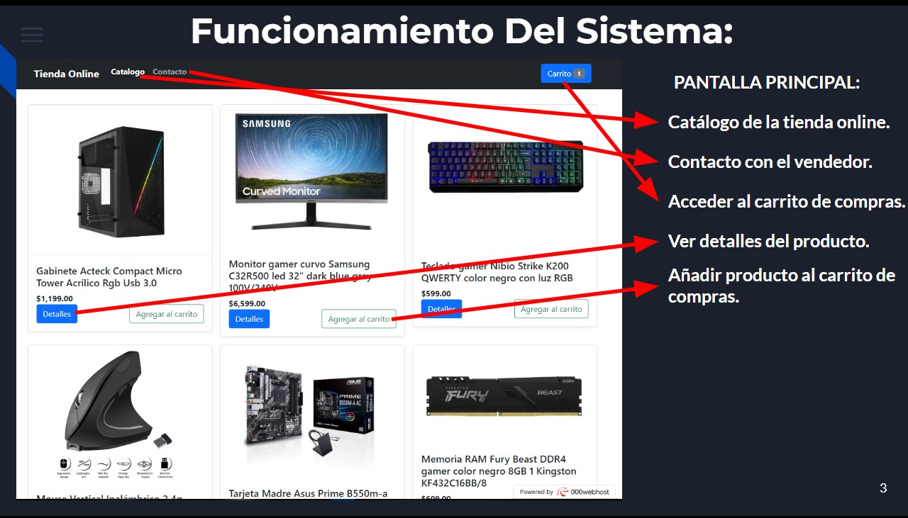
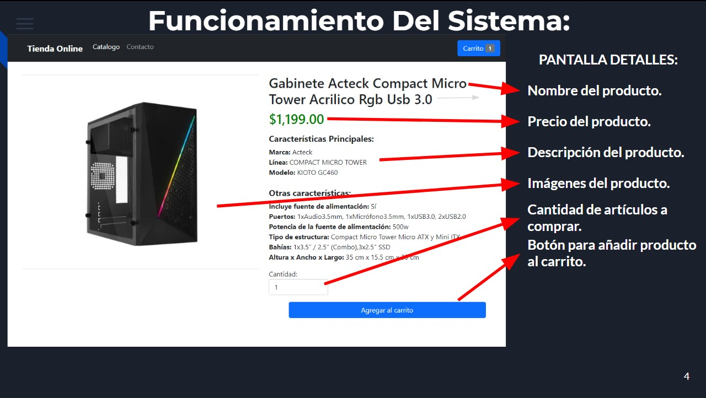
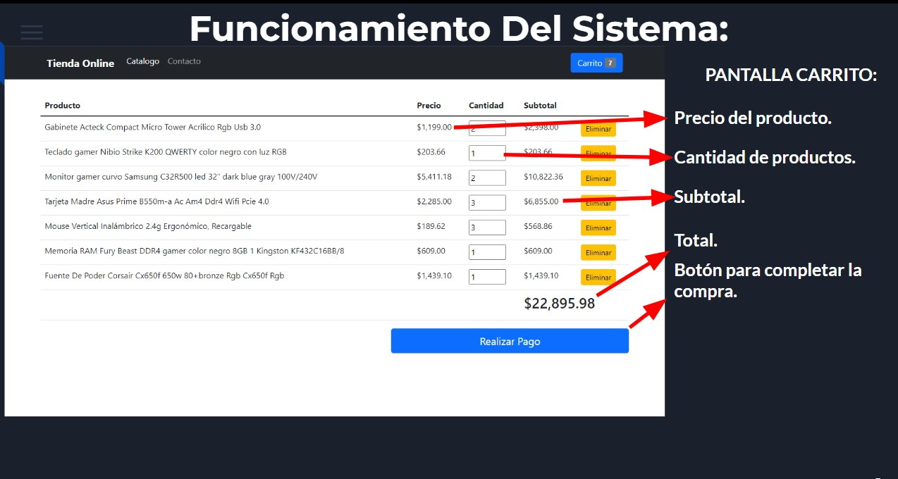
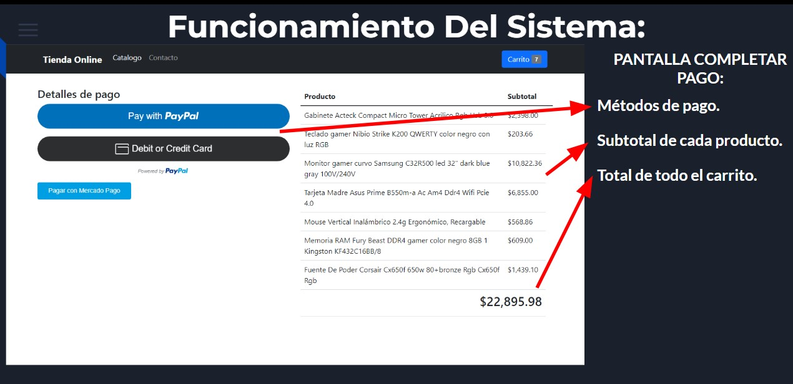
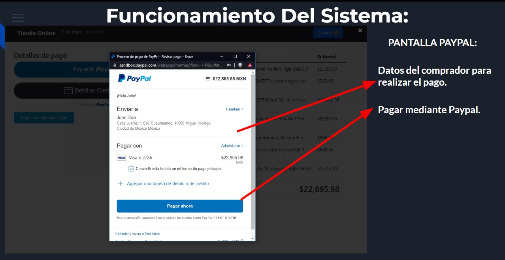
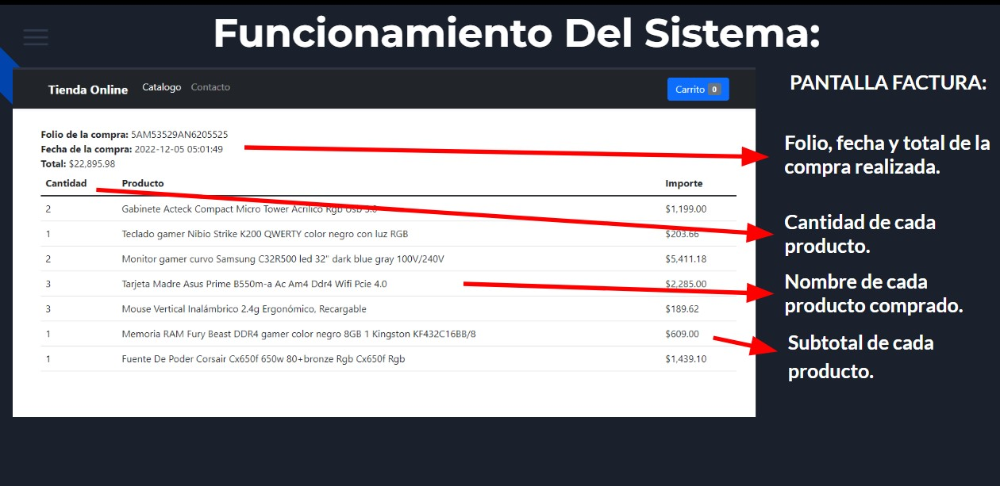
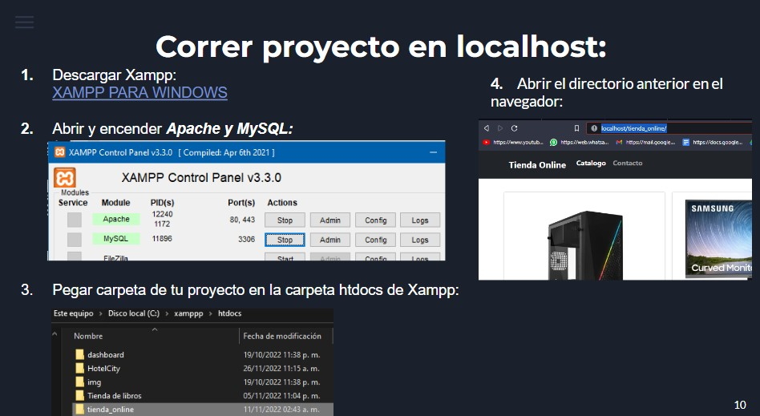

# PROYECTO FINAL

# VERSIONES

<h3> Php: 8.1.6 </h3>
<h3> Bootstrap: 5.1 </h3>
<h3> XAMPP: 8.1.6 </h3>
<h3> PhpMyAdmin: 5.2.0 </h3>
<h3> MariaDB: 10.4.24 </h3>
<h3> Apache: 2.4.54 </h3>
<h3> 000webhost: FREE version </h3>

# FUNCIONAMIENTO DEL SISTEMA:

<h2> Pantalla Principal: </h2>

<h2> Pantalla Detalles: </h2>

<h2> Pantalla Carrito: </h2>

<h2> Pantalla Metodos De Pago: </h2>

<h2> CREDENCIALES PARA REALIZAR PAGOS DE PRUEBA </h2>
  
<h2> Paypal: </h2>
  
<h3> Correo: sb-teprk22127392@personal.example.com </h3>
<h3> Contraseña: SX#3H*h6 </h3>
<h3> Numero de tarjeta: 4037 0792 3086 2735 </h3>
<h3> Fecha de expiración: 11/27 </h3>
<h3> CVV: random </h3>
<h3> Nombre: John </h3>
<h3> Apellido: Doe </h3>
     
<h2> Mercado Pago: </h2>

<h3> Numero de tarjeta: 4075 5957 1648 3764 </h3>
<h3> Fecha de expiración: 11/25 </h3>
<h3> CVV: 123 </h3>

<h2> Pantalla Factura: </h2>

# Proyecto En Locahost:
<h2><a href="https://www.apachefriends.org/es/index.html"> Descargar XAMPP para Windows <a></h2>

# Subir Proyecto en Host Gratuito:

